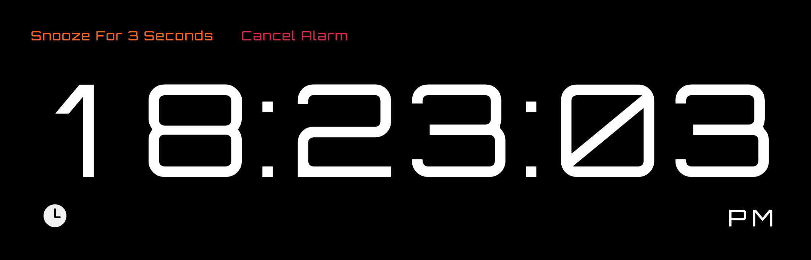
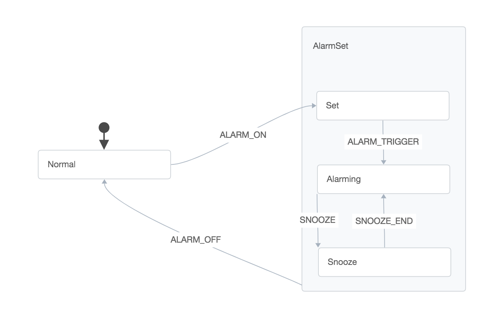

# Clock Demo

Demonstrating using statecharts with [XState](https://github.com/davidkpiano/xstate), [XStateful](https://github.com/avaragado/xstateful) & [Xstateful-React](https://github.com/avaragado/xstateful-react).

---

### Demo

---

### Process

Built using [statechart designer](https://shmck.github.io/statechart-designer/).
